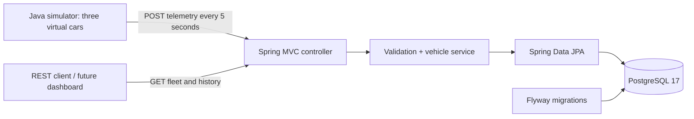
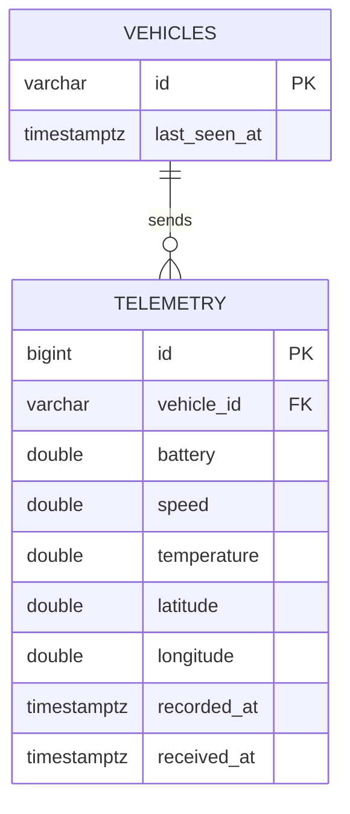

# Architecture



The simulator is a separate process that uses Java's HTTP client. It exercises the same ingestion endpoint a vehicle client would use; it never accesses the database directly.

## Request flow

1. Spring validates the JSON body and its numeric ranges before ingestion.
2. A transaction locks the target vehicle row. Unknown vehicle IDs return 404.
3. The service appends the telemetry and updates the vehicle's server contact timestamp atomically.
4. Reads derive status using a configurable 20-second timeout, so no background status job is necessary.

The lock serializes writes for the same car while allowing different cars to be updated concurrently. `lastSeenAt` cannot move backwards. An interrupted transaction cannot leave a contact timestamp without its telemetry record.

## Data model



Flyway owns schema changes; Hibernate validates rather than rewrites the schema. Database CHECK constraints mirror input ranges. The composite index `(vehicle_id, recorded_at DESC, id DESC)` supports vehicle history and latest-reading lookups. The fleet query uses PostgreSQL `DISTINCT ON` to fetch all latest readings in one query, avoiding one telemetry query per car.

`recordedAt` comes from the vehicle, whereas `receivedAt` and `lastSeenAt` come from the server. These different clocks are intentional: delayed readings remain historical measurements while an arriving message proves recent contact.

## Boundaries and tradeoffs

- Separate response records keep persistence entities out of the public API.
- History is paginated and limited to 100 records per response.
- The simulator catches network failures and sends a fresh sample on its next cycle. Under failures, request timeouts can lengthen a cycle; it does not promise real-time delivery.
- A named Docker volume retains PostgreSQL data across container restarts.
- Docker exposes only loopback ports, and the application container runs as a non-root user.
- This small fleet has no registration endpoint, message broker, authentication, retention job or delivery guarantees. Those are deliberate future extensions rather than simulated production features.

## Repository layout

```text
src/main/java/.../connectedcar/
  api/          HTTP routes, pagination and validation errors
  vehicle/      Fleet state, status derivation and transactional service
  telemetry/    Measurements, validation records and database queries
src/main/resources/db/migration/  Versioned SQL schema and seeded cars
src/test/                         HTTP + PostgreSQL + simulator tests
simulator/                        Standalone Java vehicle simulator
scripts/                          Docker stack smoke test
.github/workflows/                CI tests and container verification
```
